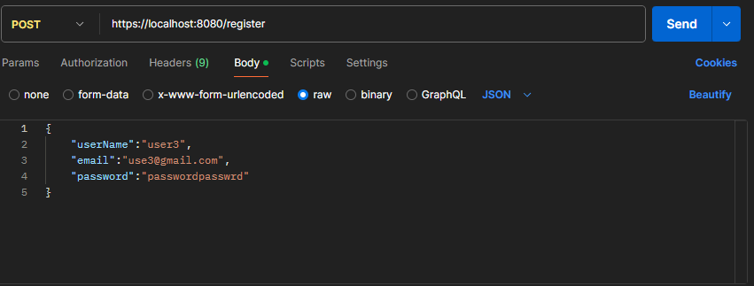
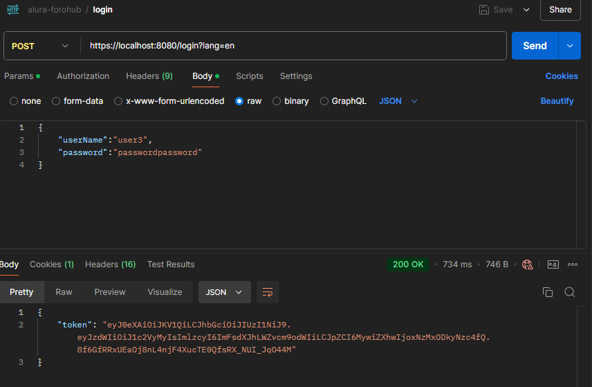
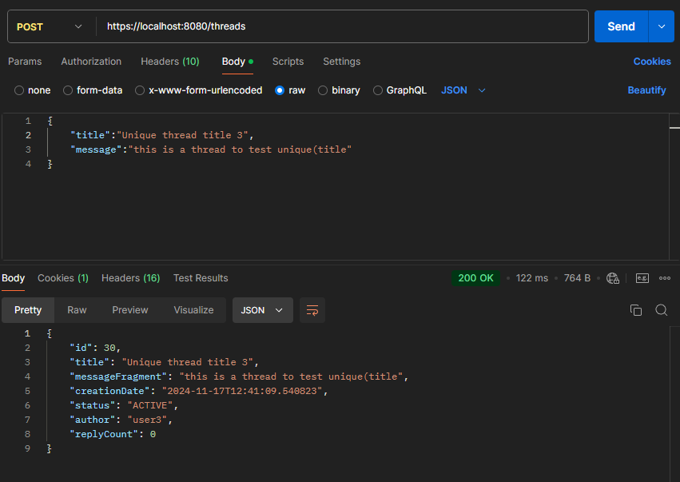
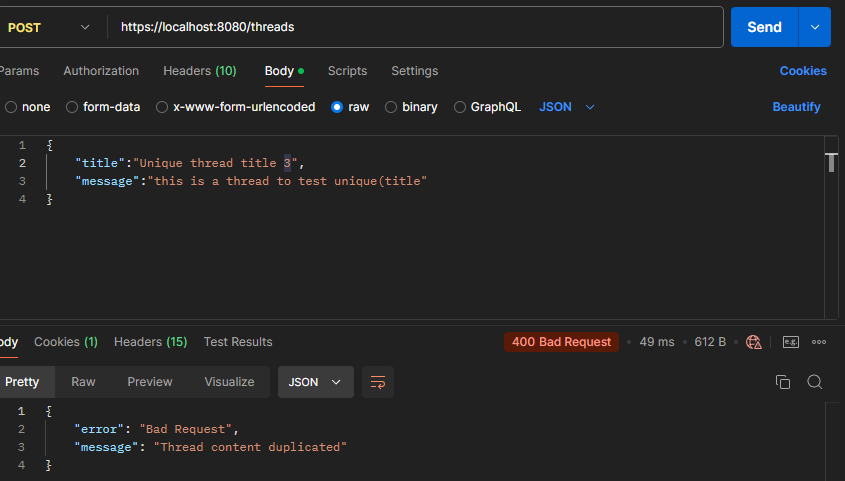
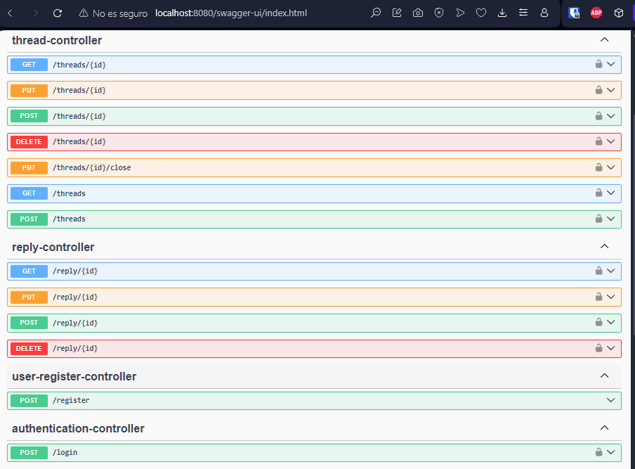

API REST simple para un foro utilizando Java Spring Boot 3

Este proyecto es parte del programa Alura One Next Education.

## Dependencias

Para ejecutar este proyecto necesitas tener instalado PostgreSQL 15 en funcionamiento.

## Instalación

Para ejecutar esta aplicación debes seguir estos pasos:

### Clonar el código fuente:

```sh
git clone https://github.com/jmortegaf/alura-challenge2.git
### Clone the source code:

```sh
git clone https://github.com/jmortegaf/alura-challenge2.git
```

### cd into the project folder:

cd alura-challenge2

### Set the environment varibles in the application.properties file inside the ``````resources`````` directory:
````
spring.datasource.url=${DB_URL}
spring.datasource.username=${DB_USER}
spring.datasource.password=${DB_PASSWORD}

jwt.secret=${JWT_SECRET}
jwt.expiration.time=${JWT_EXP}

server.ssl.key-store-password=${SSL_KEY_STORE_PASSWORD}
server.ssl.key-alias=alura-forum
server.allowed.origins=${ALLOWED_ORIGINS}
````

### Put the ssl certificate in the `````resources````` directory.

This API uses HTTPs, so you'll need to obtain a valid ssl certificate, you can obteain this using a service like letsencrypt.
if you're using certbot to get your certificate you'll need to convert the fullchain.pem and privkey.pem to a .p12 certificate using:

````
openssl pkcs12 -export \
-in /etc/letsencrypt/live/tu-dominio.com/fullchain.pem \
-inkey /etc/letsencrypt/live/tu-dominio.com/privkey.pem \
-out keystore.p12 \
-name tu-alias \
-password pass:tu-contraseña

### Run the project from the IDE

## Usage Examples

The API counts with the following endpoints

### Register User
You can register a new user in the  `````/register````` endpoint, which takes a 
request body with the username, email and password. Both the username and email must be unique.

````
{
    "userName":"tu-nombre-de-usuario",
    "email":"tu-correo",
    "password":"tu-contraseña"
}
````


### Login
The endpoint `````/login````` takes a request body with the username and password. The request response has a body
with the jwt authentication token. 

````
{
    "userName":"tu-nombre-de-usuario",
    "password":"tu-contraseña"
}


### Create new thread
You can create a new thread using the ````/threads```` endpoint with the `````POST````` method.
The request needs a body with the thread title and message, both of which should be unique.
In case they aren't the server will respond with the appropriate error message.
````
{
    "title":"Título único del hilo",
    "message":"Mensaje único del hilo"
}
````




### Swagger
This project also includes the use of the Swagger OpenAPI tools that allow the user 
to easily interact and understand the different endpoint that the API offers.
To see the Swagger interface you can visit:
``````https://localhost:8080/swagger-ui/index.html``````




Esta traducción mantiene la estructura y el formato del README original, pero con todo el contenido en español. He traducido los textos, comentarios y ejemplos, pero he dejado sin cambios los nombres de archivos, comandos y códigos específicos.
